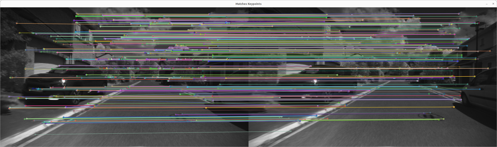

# HOOFR Keypoint Detection and Matching on FPGA

This project implements the HOOFR keypoint detection and matching algorithm, optimized for FPGA acceleration using OpenCL. Designed for real-time applications like Simultaneous Localization and Mapping (SLAM), this algorithm efficiently processes images by extracting and matching keypoints with enhanced performance over traditional CPU or GPU solutions.

## Overview

The core components of this project include:

1. **Keypoint Detection**: Using a grid-based method for fast and reliable keypoint extraction.
2. **Descriptor Computation**: Calculating robust descriptors for each keypoint to support the matching process.
3. **Keypoint Matching**: Matching keypoints between successive images with enhanced precision, optimized for FPGA execution.
4. **FPGA Acceleration**: Leveraging FPGA's parallelism for fast, energy-efficient processing, enabling real-time SLAM performance.

## Key Results

The FPGA implementation provides significant improvements over CPU implementations in terms of speed and energy efficiency, particularly for embedded systems. Key performance benchmarks include:

- **Frame Rate**: The system processes images at 30 FPS for a resolution of 1280×720 and up to 38 FPS at 640×480, suitable for real-time applications.
- **Speedup**: The FPGA-accelerated matching algorithm offers up to **14×** speedup compared to high-performance CPU implementations, with runtimes as low as 3.19ms for the matching task when executed on FPGA.
- **Energy Efficiency**: Compared to traditional GPU implementations, the FPGA offers significant power savings while maintaining comparable performance, making it ideal for energy-constrained, embedded environments.
- **Keypoint Processing**: The design handles up to 2009 keypoints at 1280×720 resolution with a cycle-per-match (CPM) rate of just 108, outperforming CPU implementations.

These results demonstrate that this FPGA-based implementation is well-suited for real-time SLAM applications, particularly in resource-constrained environments like autonomous vehicles and robotics.

## File Structure

- `host.cpp`: Main program managing image processing tasks including keypoint detection, descriptor computation, and keypoint matching, along with OpenCL kernel management.
- `host.h`: Header file containing function definitions and required includes.
- `AOCL_Utils.h`: Utility functions for managing OpenCL initialization, error handling, and device communication.
- `hoofr.cl`: OpenCL implementation of the keypoint detection, descriptor computation, and matching algorithms, optimized for FPGA.

## Key Components

### Keypoint Detection

The detection phase employs the HOOFR algorithm, structured in a grid-based format to ensure an even distribution of keypoints across the image, improving performance for SLAM applications. This method accelerates keypoint extraction on FPGAs using pipelined OpenCL kernels.

### Descriptor Computation

For each detected keypoint, a descriptor is calculated to uniquely identify it. This descriptor computation block leverages parallel execution on the FPGA to handle high-resolution images efficiently.

### Keypoint Matching

The matching process involves comparing keypoints between consecutive frames, using FPGA kernels to process multiple cells simultaneously. This reduces computational overhead and ensures real-time performance, even in embedded systems.

### FPGA Acceleration

By utilizing OpenCL, computationally intensive tasks, such as keypoint matching and descriptor computation, are offloaded to the FPGA. This allows for significant speedups compared to CPU or GPU-based systems while maintaining low power consumption, crucial for real-time SLAM in embedded systems.

## Usage

1. **Initialization**: Initialize the OpenCL platform, load FPGA kernels, and set up necessary buffers.
2. **Image Loading**: Load and preprocess images (resizing as needed).
3. **Keypoint Detection**: Run the FPGA kernel for keypoint detection.
4. **Descriptor Computation**: Compute descriptors for the detected keypoints.
5. **Keypoint Matching**: Match keypoints between consecutive images.
6. **Visualization**: Use OpenCV to visualize the results and matched keypoints.

## Dependencies

- **OpenCL**: Required for FPGA acceleration.
- **OpenCV**: For image processing and visualization. Install a version compatible with HOOFR.
- **Intel FPGA SDK for OpenCL**: Needed to compile and run OpenCL kernels on FPGA.

## Building and Running

### Prerequisites

1. **Install Intel FPGA SDK for OpenCL 19.1 (Prime Pro Edition)**. You can find the SDK [here](https://www.intel.com/content/www/us/en/software-kit/665933/intel-quartus-prime-pro-edition-design-software-version-19-1-for-linux.html). A valid OpenCL license is required.
2. **Download and place the DE5a-Net DDR4 Edition BSP** in the `hld/board` folder. The BSP can be found [here](https://www.terasic.com.tw/cgi-bin/page/archive.pl?Language=English&CategoryNo=231&No=1108&PartNo=4#contents).
3. **Install OpenCV** for image processing and visualization, ensuring compatibility with the HOOFR algorithm.

### Environment Setup

1. Add the following environment variables to your `.bashrc` file:

   ```bash
   export INTELFPGAOCLSDKROOT=<path_to_intel_fpga_sdk_for_opencl>
   export AOCL_BOARD_PACKAGE_ROOT=<path_to_hld/board/de5a_net_ddr4>
   export PATH=$INTELFPGAOCLSDKROOT/bin:$PATH
   export LD_LIBRARY_PATH=$INTELFPGAOCLSDKROOT/host/linux64/lib:$LD_LIBRARY_PATH
   ```

2. Apply the changes by running:

   ```bash
   source ~/.bashrc
   ```

### Compilation

1. Clone the repository:

   ```bash
   git clone <repository_url>
   cd <repository_directory>
   ```

2. **Compile the OpenCL kernel:**

   - For FPGA Board:

     ```bash
     aoc -v ../hoofr.cl -o hoofr.aocx
     ```

   - For Emulation:

     ```bash
     aoc -v -march=emulator ../hoofr.cl -o hoofr.aocx
     ```

3. Build the host application using CMake:

   ```bash
   mkdir build
   cd build
   cmake ..
   make
   ```

### Running the Project

1. Place your input images in the `images` folder.
2. Execute the program:

   - **For FPGA Board:**

     ```bash
     ./host
     ```

   - **For Emulation:**

     ```bash
     env CL_CONTEXT_EMULATOR_DEVICE_INTELFPGA=1 ./host
     ```

3. The program will process the images and display matched keypoints using OpenCV.

   
